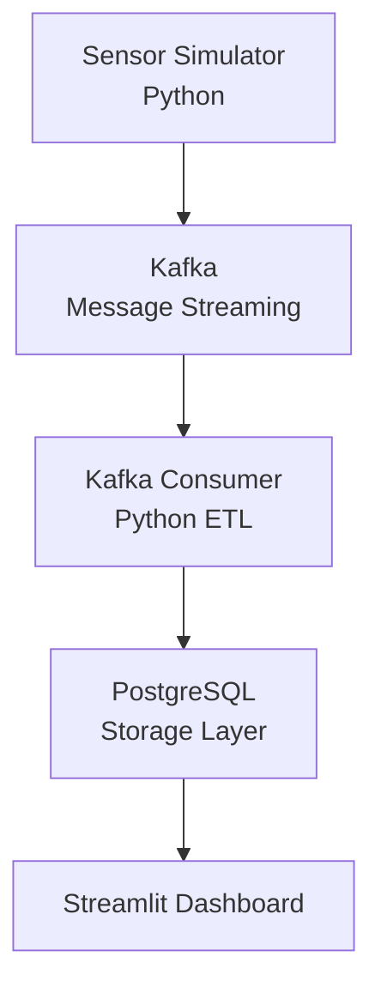

# Smart_Manufacturing_IOT_Pipeline
A real-time data engineering pipeline that simulates industrial IoT sensor data, processes streaming data using Kafka, stores it in PostgreSQL, and visualizes machine health using a Streamlit dashboard with anomaly detection capabilities.

## Project Overiew
- This project simulates a real-world smart manufacturing system where multiple machines continuously generate sensor data such as temperature, vibration, pressure, and energy consumption.

- The system demonstrates an end-to-end data engineering pipeline including data generation, streaming ingestion, transformation, storage, and visualization.

## Key Features
- Real time IoT sensor data simulation
- Streaming data pipeline using Kafka
- ETL processing with python
- Data storage in PostgreSQL
- Interactive Streamlit dashboard
- Anomaly detection using Machine Learning
- Docker-based deployment

## Architecture

